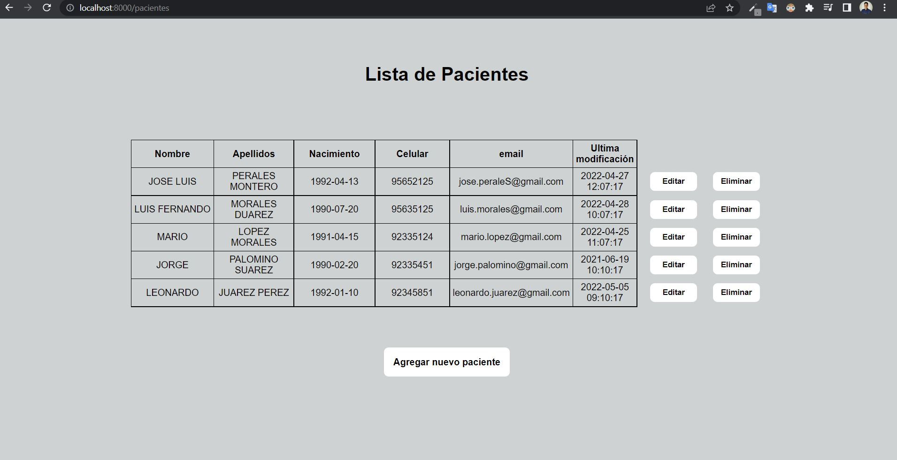
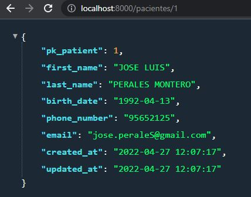
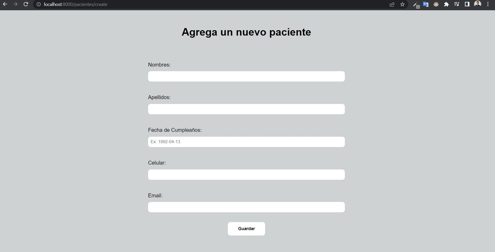
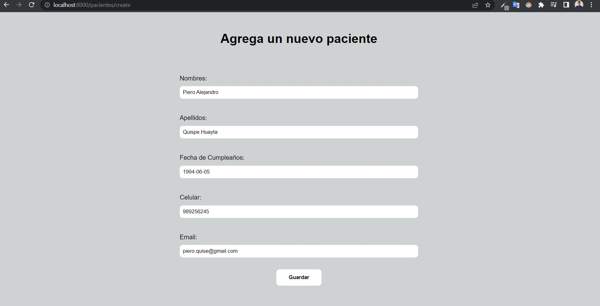
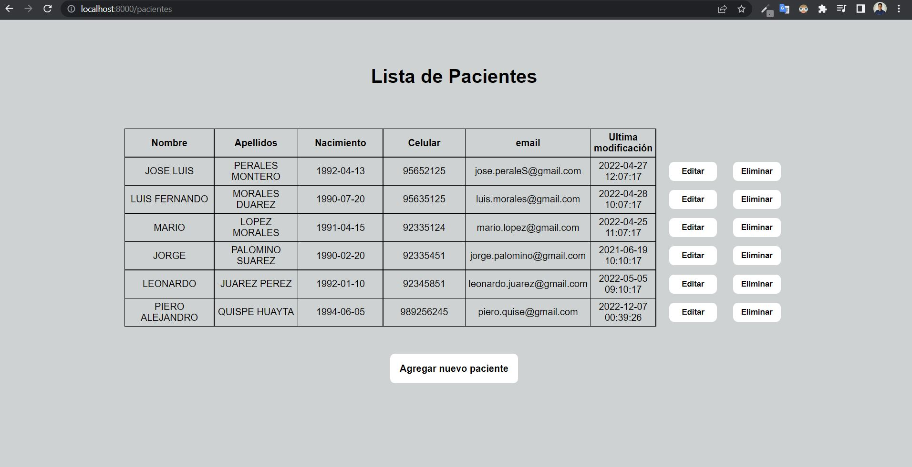
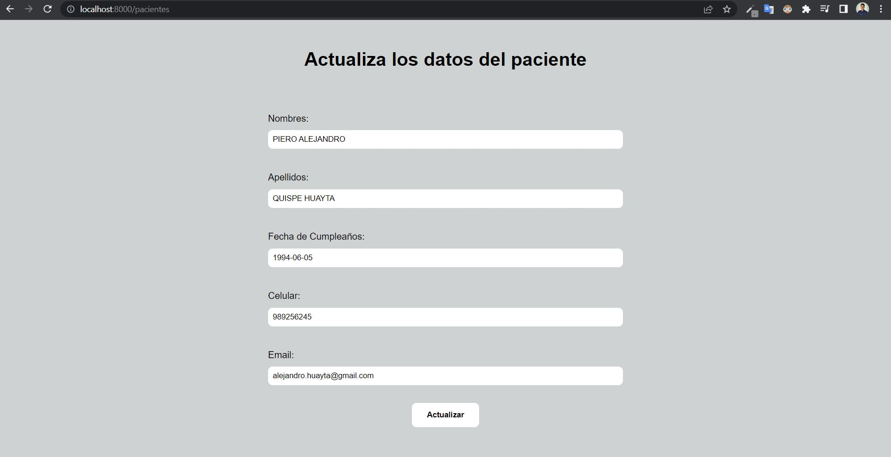
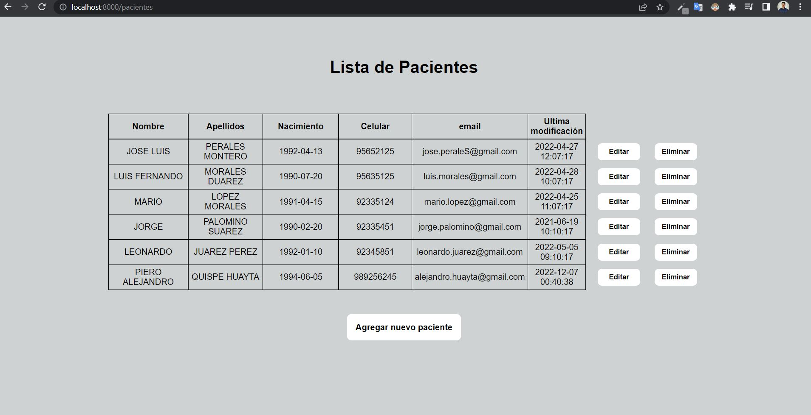
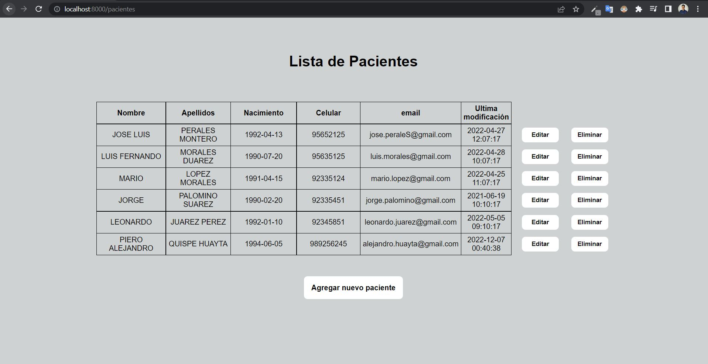
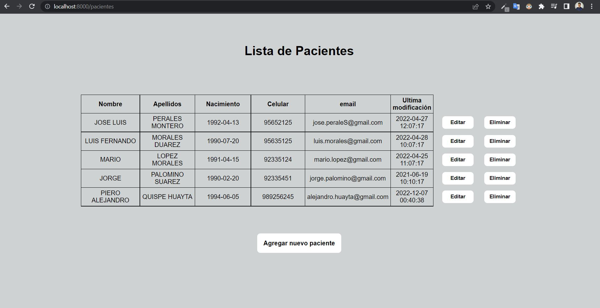

<!-- PROJECT LOGO -->
 

  

<h3 align="center">Practical Exercise</h3>

## To initialize
---
To create the user, the database and the project tables, run the following command from the project root

- `cat database/modelo.sql | sudo mysql`

To load the initial data of the project execute the following command

- `cat database/dump.sql | sudo mysql multilab_database`

To initialize composer to load composer.json
- `composer install`

## To run
---
For run the program you must use the following command from the root of the project.
- `php -S localhost:8000 router/routes.php`

### Relational Database
---
The database was made in Mysql. What is shown below is the entity relationship model diagram

### CRUD (Create, read, update and delete)
---

- GET /centrosmedicos --> list medical centers

- GET /pacientes --> list patients

- GET /pacientes/:id --> list patients by id

- POST /pacientes --> create a patient

Before
---

After
---

- PUT /pacientes/:id --> update data of a specific patient

Before
---

After
---

- DELETE /pacientes/:id --> delete a specific patient

Before
---

After
---

## Authors
---

- Luis Manrique - <luismanrique158158@gmail.com> [![LinkedIn][linkedin-shield]][linkedin-url-luis]

[linkedin-shield]: https://img.shields.io/badge/-LinkedIn-black.svg?style=for-the-badge&logo=linkedin&colorB=555
[linkedin-url-luis]: https://www.linkedin.com/in/luis-manrique158158/