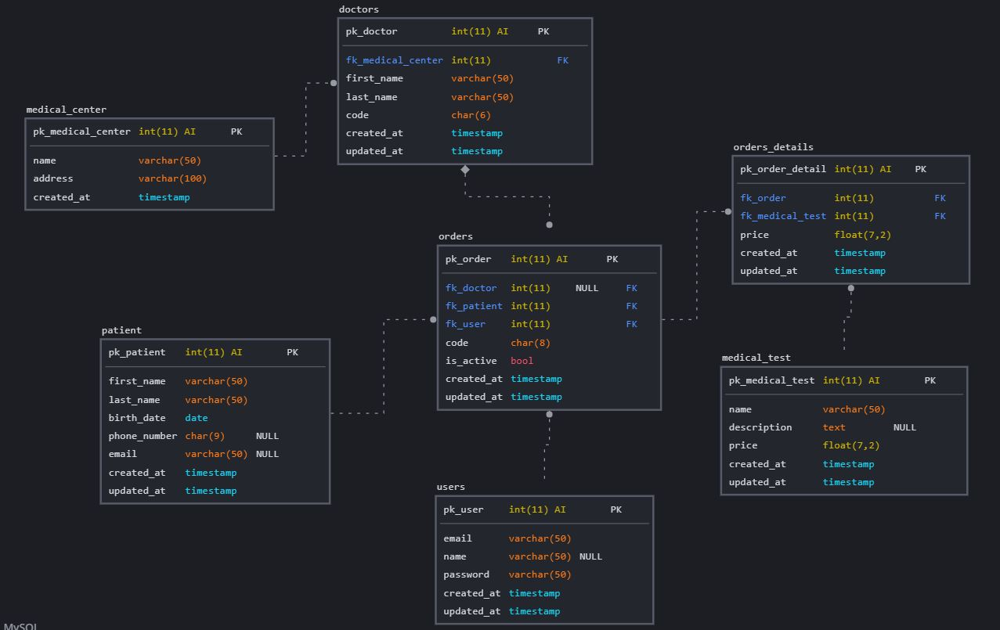
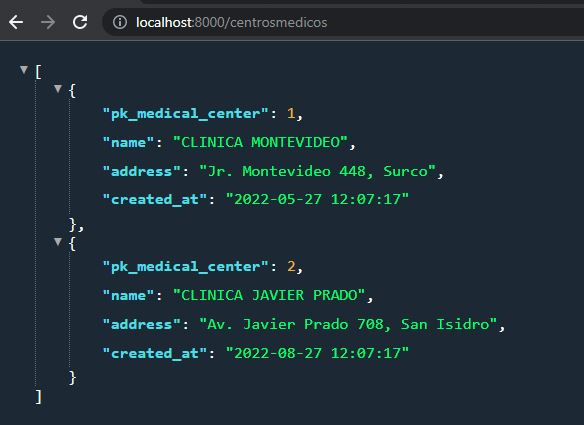

<!-- PROJECT LOGO -->
 

  

<h3 align="center">Practical Exercise</h3>

## To run
---
Tor run the program you must use the following command from the root of the project.
- `php -S localhost:8000 router/router.php`

## Authors
---

- Luis Manrique - <luismanrique158158@gmail.com> [![LinkedIn][linkedin-shield]][linkedin-url-luis]

[linkedin-shield]: https://img.shields.io/badge/-LinkedIn-black.svg?style=for-the-badge&logo=linkedin&colorB=555
[linkedin-url-luis]: https://www.linkedin.com/in/luis-manrique158158/

### DATABASE
---
The database was made in Mysql. What is shown below is the entity relationship model diagram

### EXERCISES
---

- Exercise 1: GET/centrosmedicos

